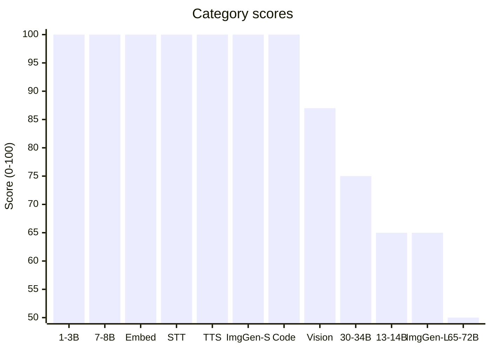

# LMfit — LLM & AI Capability Scanner

**Scan your hardware and find out which AI models you can run locally.**

LMfit auto-detects your CPU, RAM, GPU and VRAM, then scores 12 AI model
categories and hundreds of individual models to tell you exactly what fits
on your machine — and how to run it.


## Features

- **Auto-detection** of CPU, RAM, swap, GPU (NVIDIA via `nvidia-smi`) and VRAM
- **12 scoring categories**: Small LLMs (1-3B) through XXL (65-72B), embedding,
  STT, TTS, image generation, vision/multimodal, and code models
- **Individual model scoring** with 350+ models from a built-in + online catalog
- **Online catalog updates** from HuggingFace and Ollama registries (`--update`)
- **Installed tool detection** (Ollama, llama.cpp, KoboldCpp, vLLM, Whisper,
  PyTorch, Transformers, etc.)
- **Markdown reports** with Mermaid bar charts, saved to `reports/`
- **JSON output** for scripting and automation (`--json`)
- **Multi-language support**: English, Dutch, German, French (`--lang`)
- **Zero config** — just run it

## Installation

```bash
git clone https://github.com/CervezaStallone/lmfit.git
cd lmfit
python3 -m venv .venv
source .venv/bin/activate
pip install psutil
```

> `psutil` is the only required dependency.

## Usage

```bash
# Basic scan — auto-detect hardware and score everything
python llm_scanner.py

# Update model catalog from HuggingFace & Ollama (internet required)
python llm_scanner.py --update

# Output as JSON (for scripting)
python llm_scanner.py --json

# Skip markdown report generation
python llm_scanner.py --no-report

# Change language (en, nl, de, fr)
python llm_scanner.py --lang nl
python llm_scanner.py -l de

# Combine flags
python llm_scanner.py --update --lang fr
```

### CLI Reference

| Flag | Description |
|------|-------------|
| `--update` | Fetch latest models from HuggingFace + Ollama |
| `--json` | Output results as JSON instead of colored terminal |
| `--no-report` | Don't generate a Markdown report file |
| `--lang` / `-l` | Output language: `en` (default), `nl`, `de`, `fr` |

## Example Output

```
══════════════════════════════════════════════════════════════════════
  🖥️  LLM & AI Capability Scanner
══════════════════════════════════════════════════════════════════════

  HARDWARE (auto-detected)
  ──────────────────────────────────────────────────
  CPU:    12th Gen Intel(R) Core(TM) i7-12700H
          14 cores / 20 threads @ 4180 MHz
  RAM:    31.0 GB total / 22.7 GB available
  GPU:    NVIDIA RTX A1000 Laptop GPU
          4096 MB VRAM (3758 MB free) | Compute 8.6

══════════════════════════════════════════════════════════════════════
  SCORES PER CATEGORY
══════════════════════════════════════════════════════════════════════

  Small LLMs (1-3B)
  ██████████████████████████████ 100/100  ★★★★★  Excellent
  Mode: GPU (full)

  Medium LLMs (7-8B)
  ██████████████████████████████ 100/100  ★★★★★  Excellent
  Mode: GPU (full)

  Large LLMs (13-14B)
  ███████████████████░░░░░░░░░░░  65/100  ★★★    Fair (slower)
  Mode: GPU+CPU offload (51% VRAM)

  ...
```

Reports are saved as Markdown files in `reports/` with Mermaid charts:



## Scoring

Each category and model gets a score from 0–100:

| Score | Rating | Meaning |
|-------|--------|---------|
| 80–100 | ★★★★★ Excellent | Runs great, full GPU or fast CPU+GPU |
| 60–79 | ★★★★ Good | Runs well, may use CPU offloading |
| 40–59 | ★★★ Fair | Possible but slower, heavier offloading |
| 20–39 | ★★ Marginal | Barely fits, very slow |
| 0–19 | ★ Too heavy | Not recommended for this hardware |

Scoring considers:
- VRAM vs. model size (can it fit fully on GPU?)
- RAM for CPU offloading (hybrid GPU+CPU)
- Quantization level (Q4, Q5, Q8, FP16)
- CPU core count and speed

## Model Catalog

LMfit ships with a built-in catalog of common models. Run `--update` to
fetch the latest from:
- **HuggingFace** — GGUF models from the Hub
- **Ollama** — models from the Ollama library

The catalog is cached locally in `models_catalog.json`.

## Requirements

- Python 3.8+
- `psutil` (only runtime dependency)
- NVIDIA GPU support requires `nvidia-smi` (included with NVIDIA drivers)

## License

MIT
